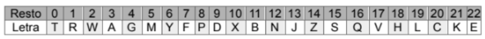
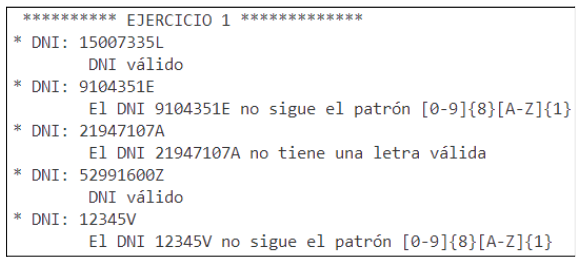

# Diseccionando un examen
El objetivo de esta práctica es **realizar paso a paso los diferentes ejercicios de un examen.**

 


Comprobaremos cómo dividiendo el problema en problemas más sencillos podemos resolverlo.

También iremos detectando **problemas que se pueden resolver por "imitación"** aplicando los conceptos aprendidos en clase en ejercicios similares.

Finalmente nos daremos cuenta que dichos ejercicios eran más fácil de solucionar de lo que en un principio nos pueda parecer.

Vamos a aprender estrategias para en un ambiente hostil, como es un examen, podamos salir victoriosos!!!!


## Ejercicio 1

Debes completar el método ejecutaEjercicio1() de la clase Utilidades (paquete es.daw.examen2ev.util).
 
En él está declarada una cadena con DNIs para las pruebas.

Crea un método en la clase Utilidades para validar la letra de cada DNI. 

Dicho método:

- Se llamará validarDNI.
- Recibirá un String con el DNI.
- Devolverá un booleano para indicar que el DNI es válido.
- Propagará la excepción DniFormatException.

Lo primero que hay que hacer es comprobar que el formato del DNI sea correcto, es decir, que esté compuesto de 8 dígitos y acabado en una letra mayúsculas.

En el caso de que el formato sea correcto, para el cálculo de la letra válida del DNI se deberá utilizar el algoritmo del Ministerio de Interior. Para verificar el DNI  de españoles residentes mayores de edad se utiliza el siguiente algoritmo:

- Se divide el número del DNI entre 23.
- Con el resto de la división se obtiene la letra en base a lo especificado en la siguiente tabla:



En el caso de que el DNI sea incorrecto, ya sea por el formato o por la letra, deberá propagarse una excepción con el mensaje apropiado en cada caso:

```
"El DNI XXXXX no tiene una letra válida"
"El DNI XXXX no sigue el patrón [0-9]{8}[A-Z]{1}"
```

Para ello crea una excepción controlada llamada DniFormatException en el paquete es.daw.examen2ev.exception.

En el método ejecutaEjercicio1() haz la llamada al método con cada DNI y muestra un resultado por consola similar al siguiente:




