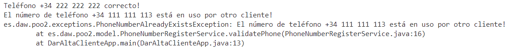

# Ejercicios para trabajar con excepciones propias checked (comprobadas)

# Ejercicio 1: PhoneNumberAlreadyExistsException 

1. Descarga los fuente iniciales
2. Crea la excepción PhoneNumberAlreadyExistsException en el paquete es.daw.poo2.exceptions.
3. En el método **validatePhone** de la clase PhoneNumberRegisterService implementa el código para comprobar si el número existe en la lista de números proporcionados. Observa cómo se crea el List.
4. Cuando dicha lista contenga el número recibido como argumento, debe crear, lanzar y propagar la excepción con el mensaje "El número de teléfono XXXXX está en uso por otro cliente!"
5. En la clase principal haz la prueba con varios números de teléfono, uno que no esté repetido y otro que lo esté ("+34 222 222 222", "+34 111 111 113") 

Deberás obtener algo similar a esto:

